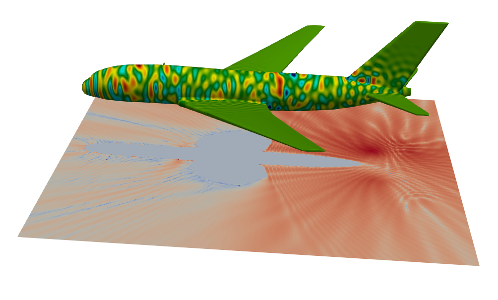

# solvers3d

## FMM-accelerated boundary integral equation solvers

Currently supports high-order triangulation of smooth surfaces

Upcoming support for: 
-  High order quadrilaterization versions of the above routines 
-  High order triangulation of surfaces with edges
-  High order triangulation of surfaces with edges and corners

This repository has two external dependencies - [FMM3D](https://fmm3d.readthedocs.io/en/latest)

Make sure you have the shared object for the FMM library installed and
located in an appropriate location (`/usr/local/lib` on MacOSX, and
environment variable of LD_LIBRARY_PATH set to location of libfmm3d.so 
on linux machines)

  
